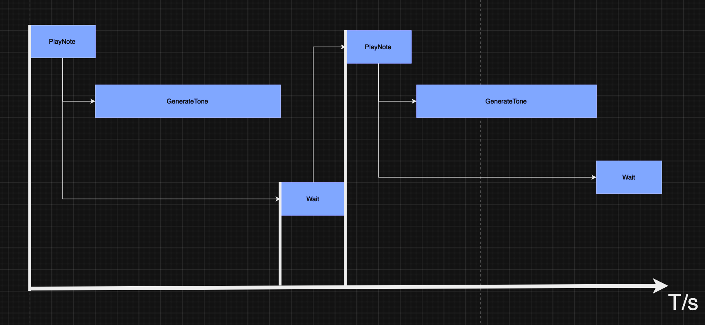

# Real-Time Music Player

## Project Description
This repository contains the implementation of a real-time music player developed as part of a course on real-time systems. The project is designed to play the "Brother John" melody using a tone generator and a music player.

## Features
- **Tone Generator**: Generates tones based on a 12-tone equal-tempered scale.
- **Music Player**: Controls the playback of the "Brother John" melody.
- **Dynamic Control**: Change key, tempo, and volume during playback.

## System Design
The system is designed using a combination of timing diagrams and access graphs to illustrate the interaction between the tone generator and the music player. The timing and access diagrams are included in this repository.

### Access Diagram


### Timing Diagram


## Setup and Installation
1. **Clone the Repository**:
    ```bash
    git clone https://github.com/amirshojay/music_player.git
    cd music_player
    ```
2. **Build the Project**: Follow the instructions in your development environment to compile the project for the MD407 board.
3. **Run the Project**: Load the compiled code onto the MD407 board and follow the instructions in the User's Guide to interact with the music player.

## User Guide
- **Start/Stop**: Control the playback of the melody.
- **Change Key**: Dynamically change the key of the melody.
- **Change Tempo**: Adjust the tempo of the melody in the range of 60 to 240 bpm.
- **Volume Control**: Increase or decrease the volume, and mute the sound.

## Files
- `application.c`: Main application code.
- `access_diagram.png`: Access diagram illustrating system interactions.
- `timing_diagram.png`: Timing diagram illustrating the sequence of operations.

## License
This project is licensed under the MIT License. See the LICENSE file for details.

## Acknowledgements
This project was developed as part of the "Introduction to Real-Time Systems" course at Chalmers University of Technology.

